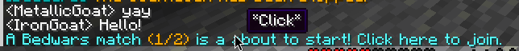

# MBedwars ClickToJoin

## Sends click to join messages to players

### Installation:
Add to the `plugins/MBedwars/add-ons` folder and restart. That's it!

### Configuration:
The General config file is found under `plugins/MBedwars/add-ons/ClickToJoin`. 
Messages can be configured in the MBedwars language file under `plugins/MBedwars/language`!

### Example
